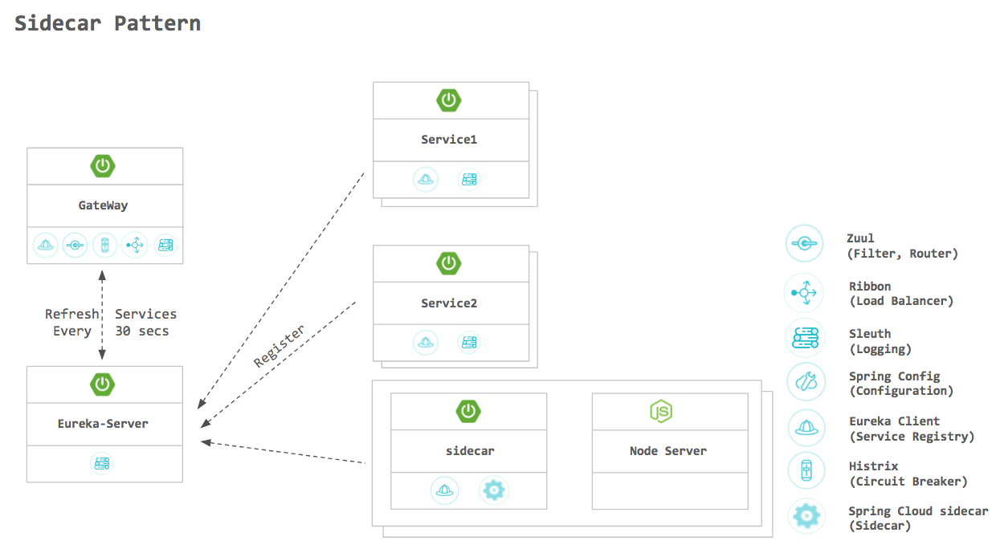

# Sidecar pattern example

- node-service : simple non JVM microservice
- sidecar : spring cloud netflix sidecar example

## 구성도



## 실행 방법
1. node-service 설치 및 실행
    ```bash
    > cd node-service
    > npm install
    > node index.js
    ```
    간단한 express 서버가 8008포트로 동작합니다.
2. sidecar 설치 및 실행
    ```bash
    > cd sidecar
    > ./mvnw clean package
    > java -jar ./target/sidecar-0.0.1.SNAPSHOT.jar
    ```
    sidecar 예제 프로그램이 8009포트로 동작합니다.


## 동작
1. discovery sidecar application
    - Eureka에 등록된 serviceId(NODE-SERVICE)로 사용 가능

    - 내부 서비스에서 node sever를 접근하는 예제 코드


2. discovery another application
    - **sidecarHostName** : **sidecarPort** / **servceId**
    - serviceId를 이용하여 Node Server에서 다른 micro service 사용 가능
    - Node server에서 http://localhost:8009/Service1/someEndPoint 를 접근하는 경우 sidecar application이 Eureka서버에서 서버 정보를 가져와 Service1으로 라우팅 해준다.
 